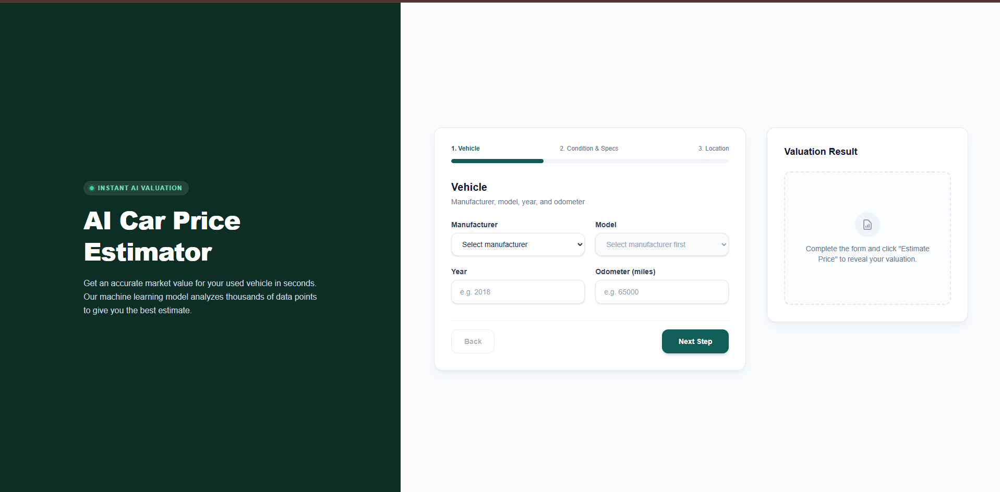
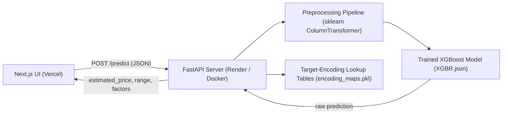
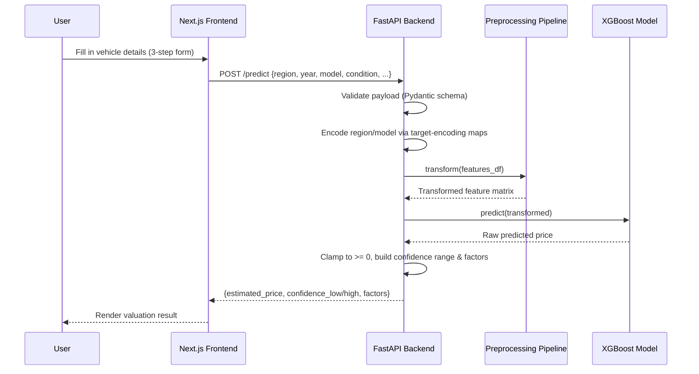
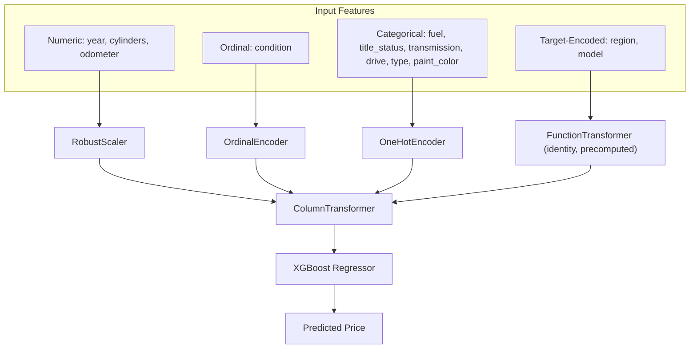

# AutoValuate — AI Car Price Estimator

> Instant, AI-powered valuations for used vehicles — trained on real-world Craigslist listing data.

<p align="center">
  
  
  
  
  
  
  
  
  
</p>

<p align="center">
  
  
  
  <br><br>
  <a href="https://used-cars-prices-prediction-la86-chi.vercel.app/">
    
  </a>
</p>





## Overview
**AutoValuate** is a full-stack machine learning application that estimates the fair market value of a used car in seconds. A user answers a short, guided form about their vehicle — make, model, condition, mileage, and location — and a trained **XGBoost** regression model, backed by a **scikit-learn** preprocessing pipeline, returns an instant price estimate along with a confidence range and the key factors driving the valuation.

Under the hood, the model was trained on the well-known **Craigslist used vehicles dataset**, using target encoding for high-cardinality categorical features (like region and model) to keep the pipeline both accurate and production-friendly. The result is wrapped in a clean **FastAPI** REST service and a polished, modern **Next.js** interface — giving it the feel of a real SaaS product rather than a notebook demo.

---

## Features

- **Instant AI Valuation** — get a price estimate in under a second from a trained XGBoost model.
- **Modern SaaS UI** — a clean, multi-step form built with Next.js, React, and Tailwind CSS.
- **Graceful Handling of Out-of-Distribution Data** — unseen regions/models gracefully fall back to sensible global averages instead of breaking the prediction.
- **Explainability Snippets** — human-readable "factors influencing this price" alongside every estimate.
- **Clean REST API** — a documented FastAPI backend that any frontend (web, mobile, or third-party) can consume.
- **Production Deployment** — frontend on Vercel, backend on Render, fully decoupled and independently scalable.

---

## Tech Stack & Architecture

| Layer | Technologies |
|---|---|
| **Frontend** | Next.js · React · Tailwind CSS · TypeScript |
| **Backend** | FastAPI · Python 3.11 · Uvicorn · Pydantic |
| **Machine Learning** | XGBoost · Scikit-Learn (ColumnTransformer, OneHotEncoder, OrdinalEncoder, RobustScaler, FunctionTransformer) · Pandas · NumPy · Target Encoding |
| **Deployment** | Vercel (frontend) · Render + Docker (backend) |

### System architecture



### Request lifecycle (sequence)



### ML preprocessing pipeline



---

## Folder Structure

```
Used-Cars-Prices-Prediction/
├── used-cars-ui/                  # Next.js frontend
│   ├── app/
│   │   ├── page.tsx               # Main multi-step valuation form
│   │   ├── data.js                # Static dropdown data (makes, models, regions...)
│   │   ├── layout.tsx
│   │   └── globals.css
│   ├── public/
│   ├── package.json
│   └── next.config.ts
│
├── main.py                        # FastAPI application & inference logic
├── Dockerfile                     # Container definition for Render deployment
├── requirements.txt                # Backend Python dependencies
├── XGBR.json                       # Trained XGBoost model (native format)
├── preprocessing_pipeline.pkl      # Fitted sklearn ColumnTransformer
├── encoding_maps.pkl                # Target-encoding lookup tables
├── Datapre_modeling.ipynb          # Data preprocessing & model training notebook
├── Exploratory Data Analysis.ipynb # EDA notebook
└── README.md
```

---

## Getting Started / Local Setup

### Prerequisites

- **Node.js** >= 18
- **Python** >= 3.11
- `git`

### 1. Clone the repository

```bash
git clone https://github.com/ahmedhamdy-DS/Used-Cars-Prices-Prediction.git
cd Used-Cars-Prices-Prediction
```

### 2. Run the backend (FastAPI)

```bash
# From the repo root
pip install -r requirements.txt

uvicorn main:app --reload --port 8000
```

The API will be available at **`http://localhost:8000`**, with interactive docs at **`http://localhost:8000/docs`**.

### 3. Run the frontend (Next.js)

```bash
# In a new terminal, from the repo root
cd used-cars-ui
npm install
npm run dev
```

The app will be available at **`http://localhost:3000`**.

### 4. Environment variables

| Variable | Where | Purpose |
|---|---|---|
| `ALLOWED_ORIGINS` | Backend (Render) | Comma-separated list of frontend origins allowed to call the API (CORS) |

```bash
# Example
ALLOWED_ORIGINS=http://localhost:3000,https://your-frontend-domain.vercel.app
```

---

## API Endpoints

| Method | Endpoint | Description |
|---|---|---|
| `GET` | `/health` | Health check — confirms the model and pipeline are loaded correctly |
| `POST` | `/predict` | Accepts vehicle details and returns an estimated price, confidence range, and contributing factors |
| `GET` | `/docs` | Interactive Swagger UI for exploring and testing the API |

**Example request body for `POST /predict`:**

```json
{
  "region": "SF bay area",
  "year": 2015,
  "manufacturer": "toyota",
  "model": "camry",
  "condition": "good",
  "cylinders": "4 cylinders",
  "fuel": "gas",
  "odometer": 65000,
  "title_status": "clean",
  "transmission": "automatic",
  "drive": "fwd",
  "type": "sedan",
  "paint_color": "silver",
  "state": "ca"
}
```

**Example response:**

```json
{
  "estimated_price": 13799.63,
  "predicted_price": 13799.63,
  "confidence_low": 12699.63,
  "confidence_high": 14899.63,
  "factors": [
    { "label": "Typical specs for this segment", "impact": 0 }
  ]
}
```

---

## Technical Notes

- **Target encoding**: `region` and `model` are high-cardinality categorical fields (thousands of distinct values), so they are encoded using precomputed mean-target lookup tables (`encoding_maps.pkl`) rather than one-hot encoding, keeping the feature space compact. Unseen categories at inference time fall back to the global mean price.
- **Column order**: the FastAPI service reconstructs the exact column order the `ColumnTransformer` was fit with (`NUM_COLS + ORDINAL_COLS + CATEG_COLS + PASSTHROUGH_COLS`) before calling `.transform()`, since scikit-learn pipelines are order-sensitive.
- **Model format**: the XGBoost model is persisted in its native `.json` format (`XGBR.json`) rather than pickled, for better long-term compatibility across XGBoost versions.
- **Version pinning**: `requirements.txt` pins `scikit-learn`, `xgboost`, and `numpy` to the exact versions used during training to avoid `InconsistentVersionWarning` issues and silently degraded predictions when unpickling the preprocessing pipeline.
- **CORS**: the backend reads allowed frontend origins from the `ALLOWED_ORIGINS` environment variable at startup, so new frontend deployments can be authorized without changing code.

---

## Author & Links

**Ahmed Hamdy**

- LinkedIn: [linkedin.com/in/My-profile](https://www.linkedin.com/in/ahmed-hamdy-4569a8360/)
- Portfolio: [my-web-3ciq.vercel.app](https://my-web-3ciq.vercel.app/)
- GitHub: [@ahmedhamdy-DS](https://github.com/ahmedhamdy-DS)

---

<p align="center">Made with care and a lot of debugging.</p>
